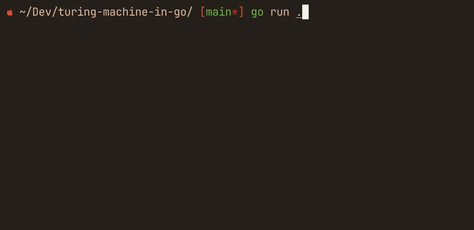

# turing-machine-in-go

A Turing Machine in Go to complement further learning in *CETM70 - Computer Science Principles And Practice* class at SU (Sunderland University).

Turing Machine in Go accepts tape as stdin and determines if given binary number is odd or even.



## Getting Started

To run the project, with Go installed, simply run `go run .`, and provide your tape as stdin.

> Important: Tape must end with an empty symbol for the Turing Machine to detect when it should stop processing

For Example: 

## Explanation with Quintuplets

The Turing Machine comprises Tape, Head, State and Transitions. The tape is an array of Symbols that can be read and written by the Turing Machine. The Turing Machine can move along the tape one place to the right or the left while storing its position on the tape in its head. The Turing Machine's potential operations can be represented wholly in Quintuplets. For Example, the quintuplet Q 0: □ → E states when State is Q and the value on the tape is 0, overwrite 0 with □ (blank) move the head to the right (□) and transition to state E. The quintuplet Q 0: □ * E similarly tells the Turing Machine to overwrite 0 with □ and allow the head to remain in its current position and finally transition to state E. This particular Turing Machine is configured to determine whether or not a number (in binary) is even.

(is even program in Quintuplets)
```
Q 0: □ → E      Q 1: □ → O  
E 0: □ → E      E 1: □ → O      E □: 1 → F  
O 0: □ → E      O 1: □ → O      O □: 0 → F 
```

## Reading

- Davis Chapter 7 Turing Conceives the All Purpose Computer, pages 121 – 152


